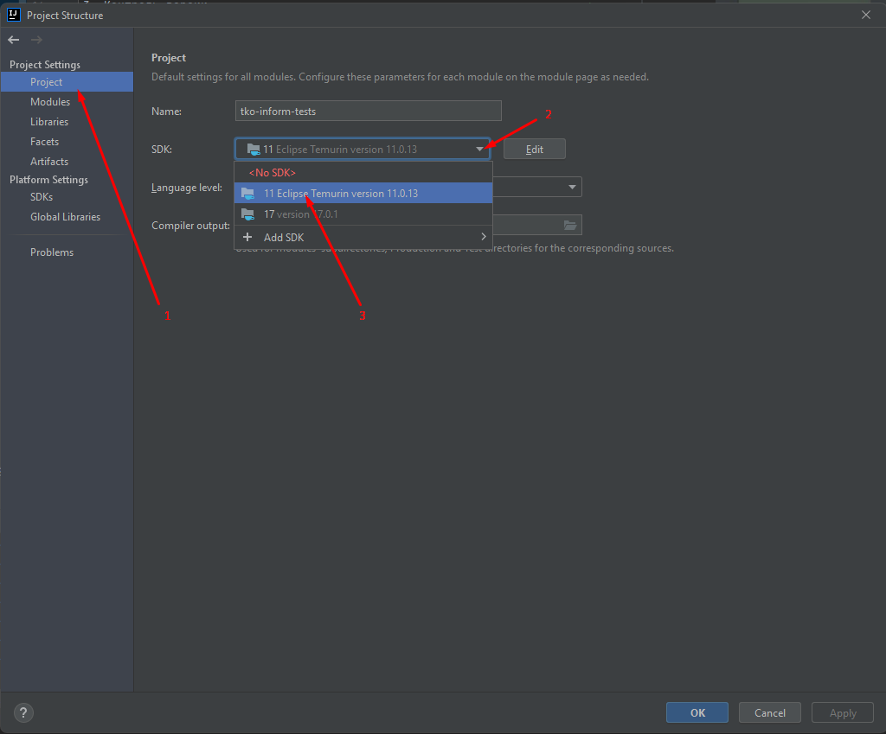
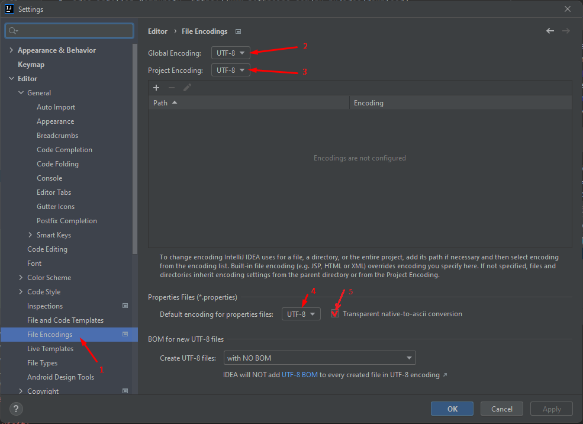

Подготовка рабочего компьютера

1. Chrome https://www.google.com/intl/ru_ru/chrome/
2. Java
   1. Установить java 11 https://adoptium.net/archive.html?variant=openjdk11,
   2. Прописать в переменных окружения https://java-lessons.ru/first-steps/java-home
      1. JAVA_HOME
      2. path
   3. Проверить корректность установки
      > java -version
3. Maven
   1. Скачать maven https://maven.apache.org/download.cgi 
   2. Распаковать архив https://maven.apache.org/install.html
   3. Прописать папку `bin` в переменную окружения `path` 
   4. Проверить корректность установки
      > mvn -version
4. Контроль версии
   1. Установить git https://git-scm.com/downloads
   2. Проверить корректность установки
      > git version
5. Среда разработки
   1. IntelliJ IDEA Community  https://www.jetbrains.com/ru-ru/idea/download/
6. Скачать проект
   1. <!-- Сгенерить ключ ssh и добавить в гит https://gitlab.site.name/-/profile/keys) -->
   2. Клонировать репозиторий
      >git clone https://github.com/yuliya-polyakova/autotesting-template.git
   3. В случае, если появится ошибка конфликта SSL-сертификата (типа ```unable to access 'https://gitlab.site.name/tests.git/': schannel: SEC_E_UNTRUSTED_ROOT (0x80090325) - The certificate chain was issued by an authority that is not trusted.```), то необходимо через терминал в IDEa отключить проверку и повторить клонирование:
      >git config --global http.sslVerify false      
7. Работа с idea
   1. Открыть `pom.xml` из директории как проект
   2. Настроить проект 
      1. Указать используемую java 
      2. Указать кодировку 
      3. Запретить импорт
            через `*` 
      4. Автоматически выполнять оптимизацию импорта перед
         комитом 
      5. Установить plugin `Allure TestOps Support`
         1. Авторизоваться https://support.site.name/youtrack/articles/TESTING-A-114 
            1. В меню "Tools" - "Allure" - "Authorize"
            2. Ввести Endpoint:"https://allure-testops.site.name/"
            3. Ввести Token: "ключ полученный в allure"
      6. Настройка перехода на тикеты 
         1. В меню "File" - "Settings..." - "Version Control" - "Issue Navigation" - "Add Issue Navigation Link" 
         2. Ввести правила для перехода в Youtrack 
            1. Issue Id: TESTING-\d+
            2. Issue Link: https://support.site.name/youtrack/issue/$0
            3. Сохранить
         3. Повторить "Add Issue Navigation Link", ввести правила для перехода в Allure-Testops
            1. Issue Id: AllureId-(\d+)
            2. Issue Link: https://allure-testops.site.name/project/1/test-cases/$1
            3. Сохранить
   3. Отладка теста
      1. Тесты расположены `tests/src/test/java/polyakova/test/tests/selenium`
      2. Классы являются test suite, методы класса test case
      3. Поставить точку остановки на первой строчке внутри метода (например `LoginScenario.login`)
      4. Чтобы запустить конкретный тест, на имени тестового метода, нажимае правой клавишей, в контекстном меню выбираем пункт `Debug` 
      5. Проект компилируется и запустится код, выполнение прервется на точке остановки
      6. Для выполнения следующего шага теста нажать F8
8. JMeter
   1. Скачать JMeter https://jmeter.apache.org/download_jmeter.cgi
   2. Распаковать
   3. Для запуска использовать исполняемый файл jmeter.bat или jmeter.sh из папки bin 
9. Дополнительно может понадобится
   1. Текстовый редактор `notepad++` https://notepad-plus-plus.org/downloads/
   2. Программа для захвата экрана `lightshot` https://app.prntscr.com/

