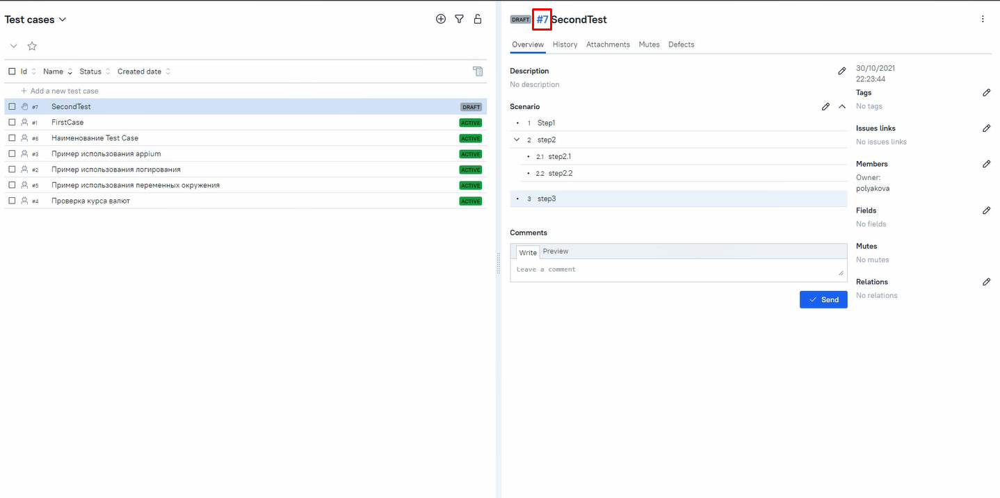
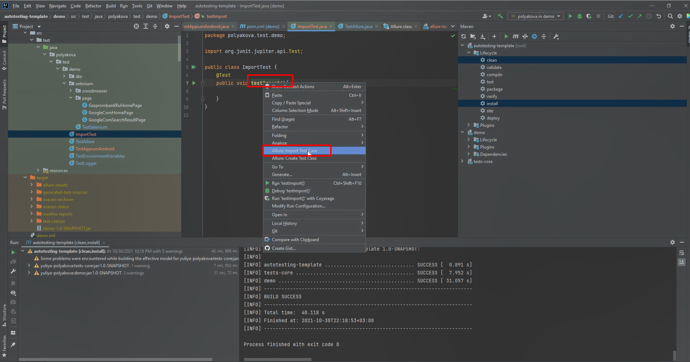
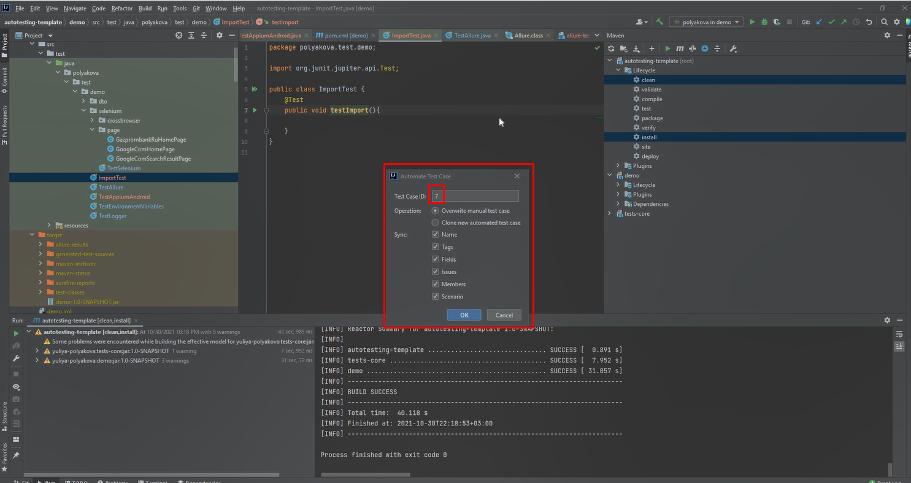
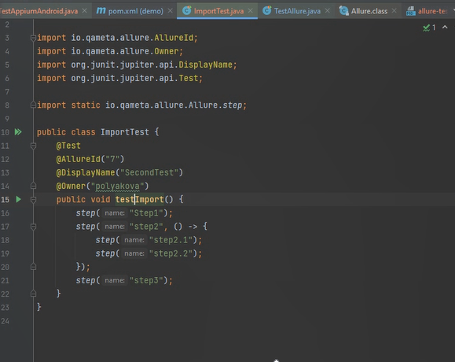

Автоматизация теста

1. Перед написанием теста необходимо ознакомиться
   1. Примеры расположены `tests-demo/src/test/java/polyakova/test/demo`
      1. Пример использования аннотаций Allure `tests-demo/src/test/java/polyakova/test/demo/TestAllure.java`
      2. Пример использования переменных окружения `tests-demo/src/test/java/polyakova/test/demo/TestEnvironmentVariables.java`
         1. Значения переменные хранится в  `tests-demo/src/test/resources/environment_dev.properties`
      3. Пример тестирования пользовательского интерфейса c использованием selenium и паттерна PageObject `tests-demo/src/test/java/polyakova/test/demo/selenium/TestSelenium.java`
   2. Имеющиеся тесты и описания страниц `tests/src/test/java/polyakova/test/selenium`
2. За основу теста берем указанный в тикете testcase, его необходимо проимпортировать в idea
   1. Выбираем или создаем класс соответствующий необходимой Suite (аннотация над классом `@DisplayName("Наименование Suite")`)
      1. Наименование класса `"Перевод на английский suite"+Test`
   2. Создаем метод для тест кейса 
      1. Наименование `test+"Перевод на английский имени testcase"`
      2. Добавляем над методом аннотацию `@Test`
   3. Копируем идентификатор testcase из allure 
   4. В контекстном меню на имени метода выбрать пункт `Allure Import Test Case` 
   5. Задать ID теста из Allure testops и нажать OK 
   6. Импорт успешно произошел 
   7. Реализовать проимпормированные шаги
      1. Созданный автоматически метод step комментируем
      2. На следующей строчке пишем вызов метода (наименование методов = краткое наименованию шага на английском, например: Нажать кнопку сохранить = clickSaveButton), над реализацией метода должна быть аннотация `@Step` с соответствующим описанием
      
