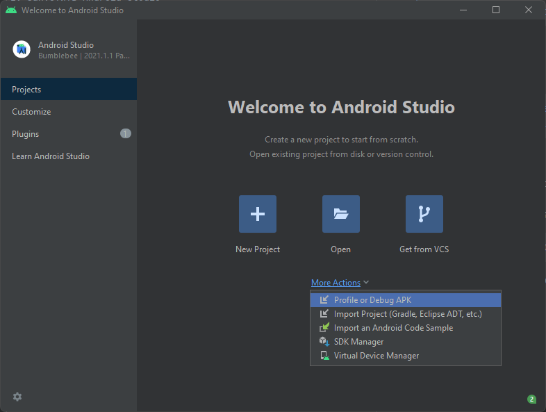
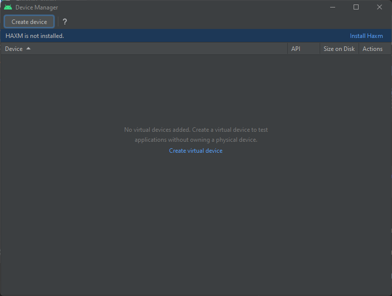
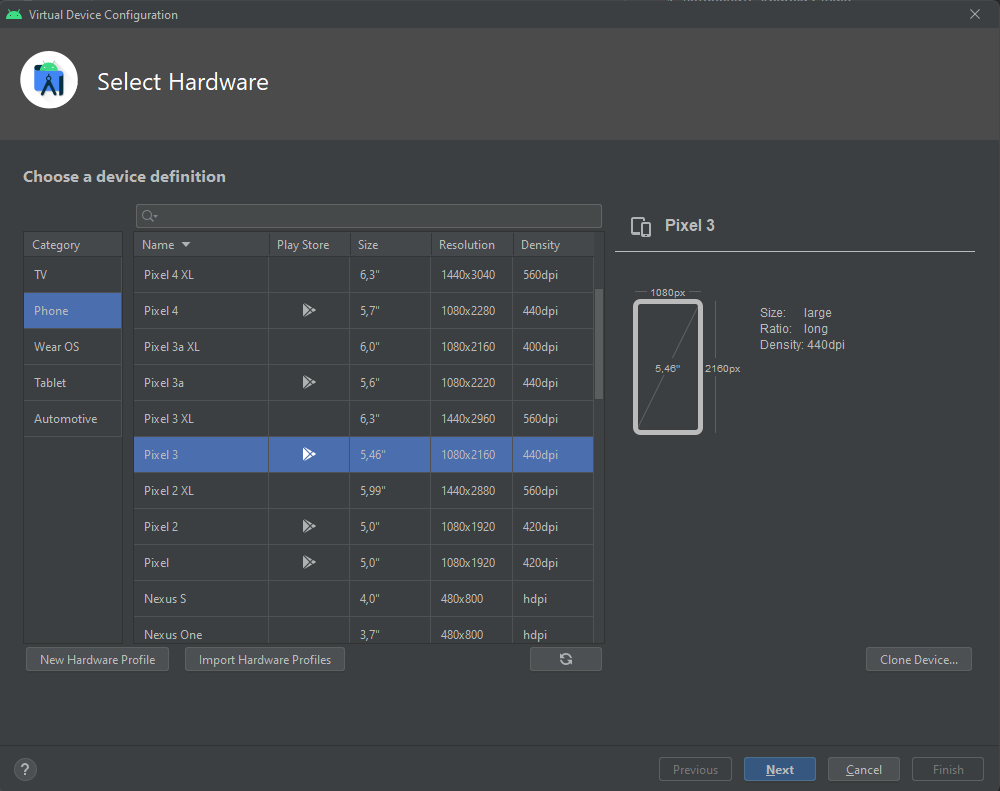
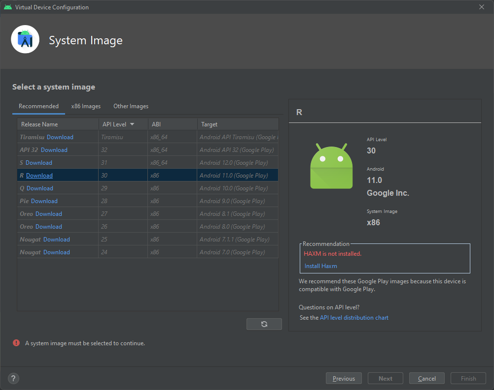
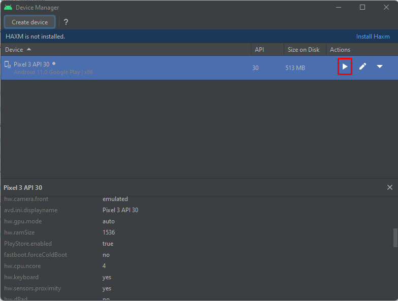
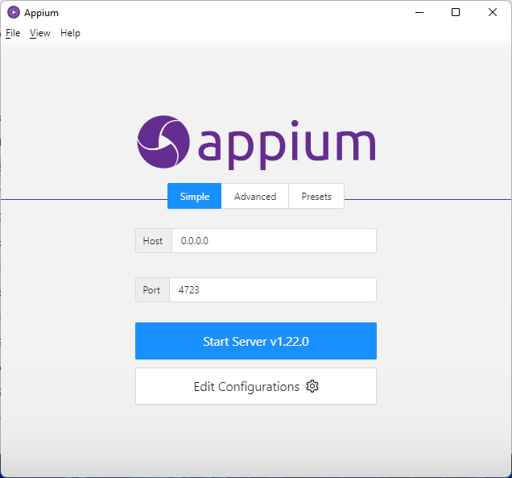
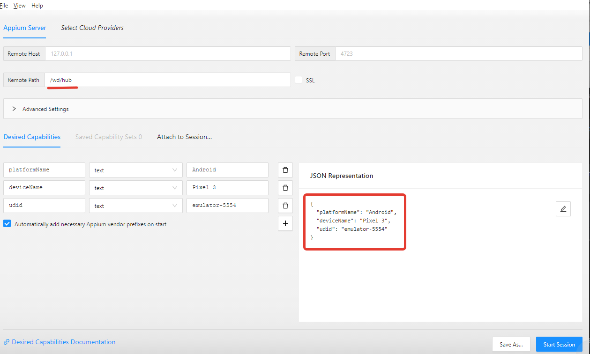

1. Установить Android Studio
   > https://developer.android.com/studio
   1. Запустить Android Studio
   2. Добавить эмулятор
      1. More Actions 
      2. Virtual Device Manager
      3. Create device 
      4. Pixel 3 
      5. Android 11 
         1. Download
         2. Next
         3. Finish
   3. Запустить эмулятор 
2. Установить Appium
   > https://github.com/appium/appium-desktop/releases
   1. Запустить Appium Server 
3. Установить утилиту для работы с элементами UI на мобильном устройстве
   > https://github.com/appium/appium-inspector/releases
   1. Настроить 
   > {
   "platformName": "Android",
   "deviceName": "Pixel 3",
   "udid": "emulator-5554"
   }
   2. Start Session