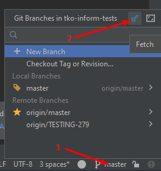
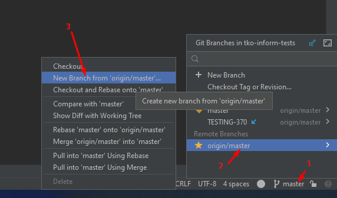
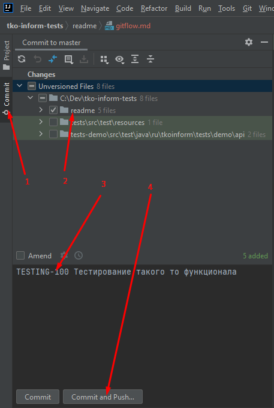
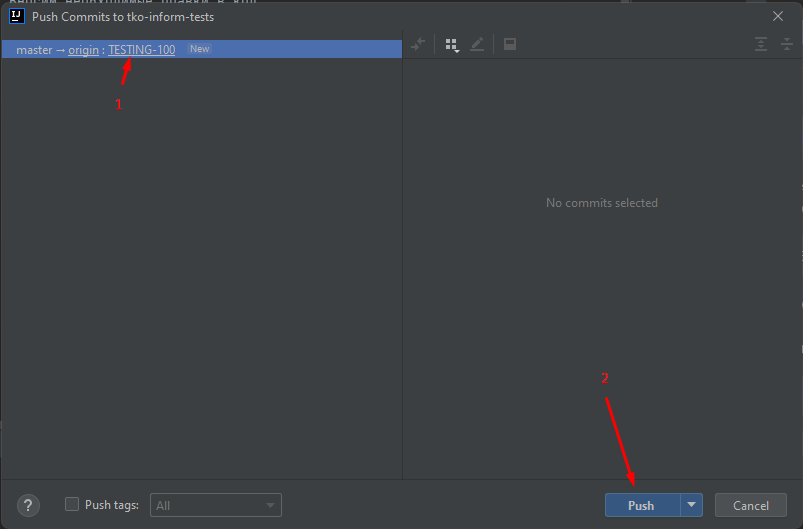

# Working on a ticket

1. Update code
   1. Idea 
   2. Or through the console
   > git fetch --all
2. Checkout from the master branch to the local branch with the ticket name (for example, TESTING-100)
   1. Idea 
   2. Or through the console
      > git checkout -b TESTING-100 origin/master
3. We make the necessary changes to the code
   > work in idea
4. Commit to the local repository
   1. idea 
      1. Select files to commit
      2. Be sure to include a commit comment
         > TESTING-100 Ticket name
         1. We take from the ticket, if there are several commits on the ticket, then additionally indicate what was done in a particular commit
            > TESTING-100 Testing such and such functionality. Steps 10-20 
   2. Or through the console
      > git add new_file_name
      > git commit -m 'TESTING-100 Ticket name'
5. Send a commit to the repository
   1. idea 
   2. Or through the console
      > git push origin TESTING-100:TESTING-100
6. Create a merge, after push in the log there will be a link to create a merge (for example, https://gitlab.site.name/qa/-/merge_requests/new?merge_request%5Bsource_branch%5D=TESTING-370) , or manually through the web page https://gitlab.site.name/qa/tests/-/merge_requests
   1. We take the name from the ticket (for example, "TESTING-100 Ticket name")
   2. If there is a warning in merge that intervention is needed, manually resolve conflicts
      > git merge origin/master
      > git push origin TESTING-100:TESTING-100
7. Edits based on comments are made by a new commit to the same branch