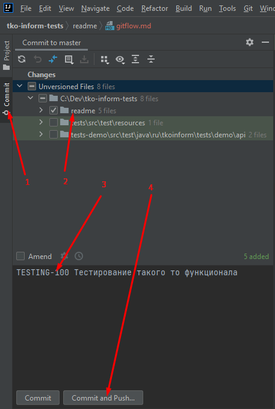

# Работа над тикетом

1. Обновить 
   1. Idea 
   2. Или через консоль
   > git fetch --all
2. Делаем checkout c ветки master в локальную ветку с именем тикета (например TESTING-100)
   1. Idea 
   2. Или через консоль
      > git checkout -b TESTING-100 origin/master
3. Вносим необходимые правки в код
   > работаем в idea
4. Выполняем коммит в локальный репозиторий
   1. idea  
      1. Выбираем файлы которые необходимо закомитить
      2. Обязательно указать комментарий коммита 
         > TESTING-100 Наименование тикета
         1. Берем из тикета, если по тикету несколько коммитов, то указываем дополнительно, что было сделано в конкретном коммите
            > TESTING-100 Тестирование такого то функционала. Шаги 10-20 
   2. Или через консоль
      > git add имя_нового_файла
      > git commit -m 'TESTING-100 Наименование тикета'
5. Отправляем коммит в репозиторий
   1. idea 
   2. Или через консоль
      > git push origin TESTING-100:TESTING-100
6. Создаем merge, после push в логе будет ссылка на создание merge (например https://gitlab.site.name/tests/-/merge_requests/new?merge_request%5Bsource_branch%5D=TESTING-370), или вручную через веб страницу https://gitlab.site.name/tests/-/merge_requests
   1. Наименование берем из тикета (например "TESTING-100 Наименование тикета")
   2. Если в merge есть предупреждение, что необходимо вмешательство, вручную рашаем конфликты
      > git merge origin/master
      > git push origin TESTING-100:TESTING-100
7. Правки по замечаниям оформляется новым коммитом в туже ветку 