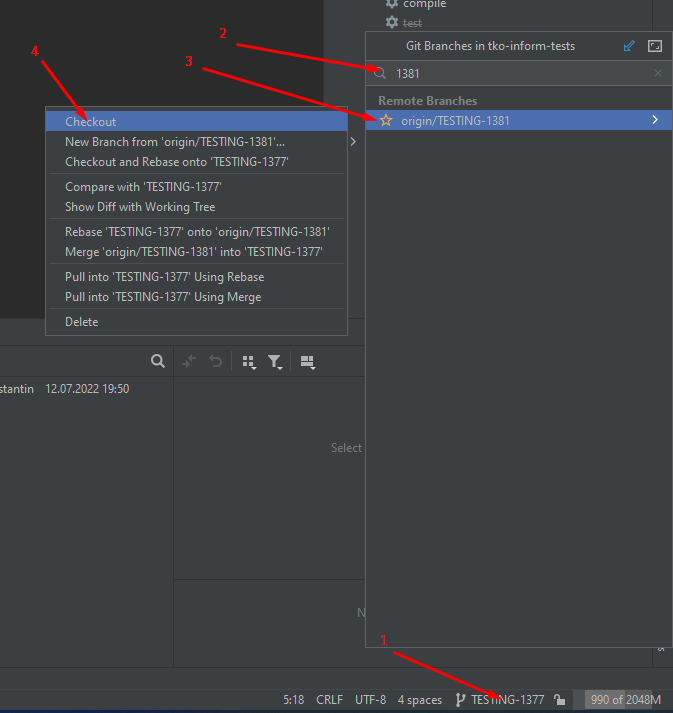

# Процесс проверки merge request

1. Git Web открыть MergeRequest
2. Перейти на тикет и проверить его статус, должен быть RESOLVED
3. Idea checkout 
4. Idea Update Project 
5. Idea удалить замердженные ветки
6. Idea подмержить мастер 
7. Idea отфильтровать историю гита по номеру ветки 
8. Просмотреть код
9. Временно увеличить таймаут
10. Запустить тест
11. Вернуть таймаут
12. Push изменений в мастер
13. Git Web Approve
14. Git Web F5
15. Git Web check message -> проверить текст сообщения 
16. Git Web merge
17. Перейти на тикет и сменить статус на CLOSED