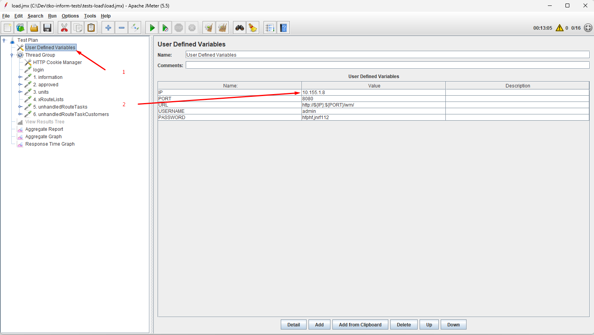
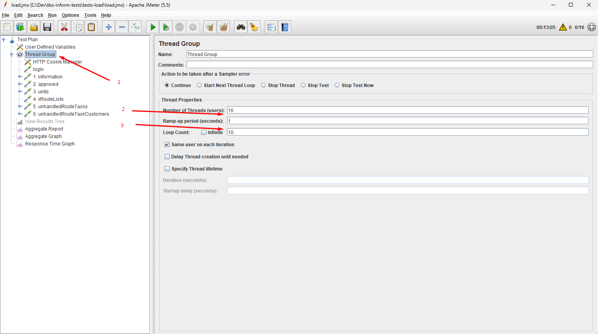
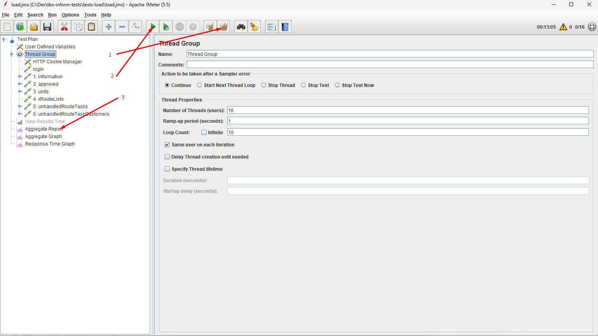

Использование JMeter для нагрузочного тестирования 

Тестирование
- открыть сценарий (*.jmx)
- настройка тестируемого стенда выполняется в ***User Defined Variables***
  
- настройка количества потоков и количества повторений в каждом из потоков настраивается в ***Thread Group***
  
- запуск
  
  1. очистить предыдущий результат
  2. запустить и дождаться завершения тестирования
  3. отчет 

Для работы с JSON JMeter использует библиотеку https://github.com/json-path/JsonPath
