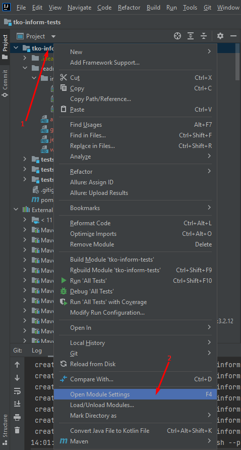
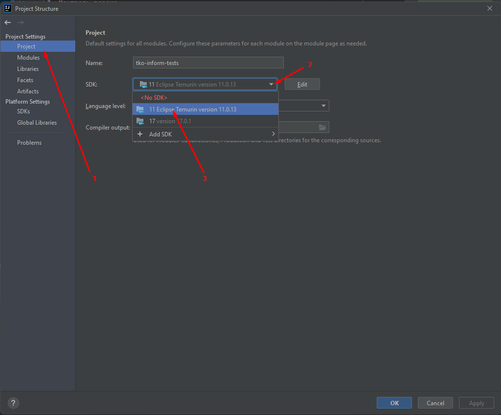
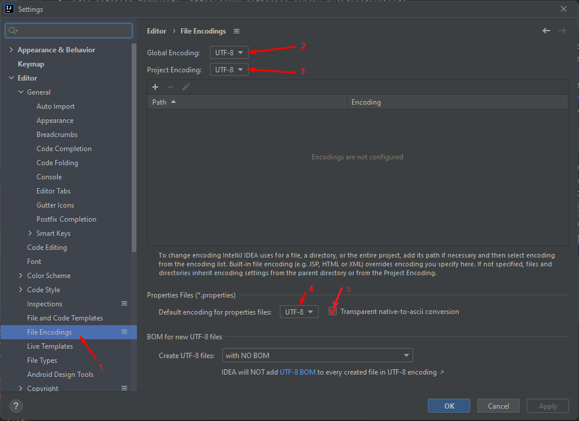
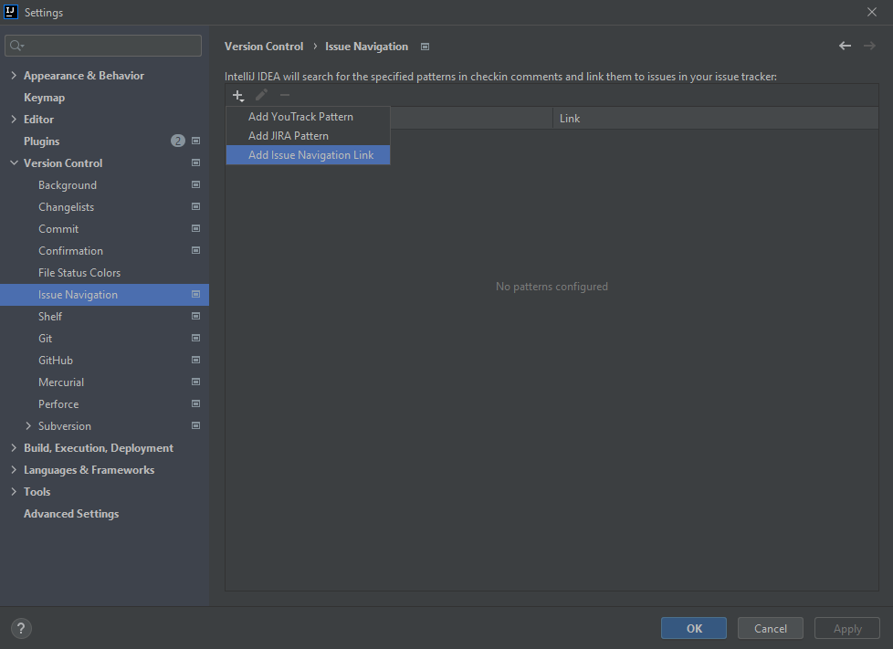
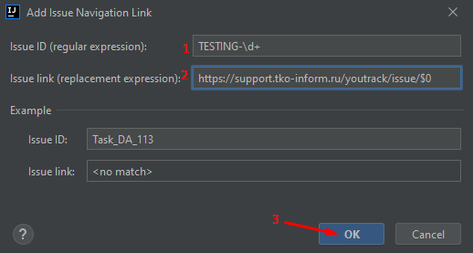

Preparing a working computer

1. Chrome https://www.google.com/intl/ru_ru/chrome/
   2 Java
   1. Install java 11 https://adoptium.net/archive.html?variant=openjdk11,
   2. Register in environment variables https://java-lessons.ru/first-steps/java-home
      1. JAVA_HOME
      2. path
   3. Check the correct installation
      > java -version
3. Maven
   1. Download maven https://maven.apache.org/download.cgi
   2. Unpack archive https://maven.apache.org/install.html
   3. Set the `bin` folder to the `path` environment variable
   4. Check the correct installation
      >mvn -version
4. Version Control
   1. Install git https://git-scm.com/downloads
   2. Check the correct installation
      > git version
5. Development environment
   1. idea intellij Community https://www.jetbrains.com/en-us/idea/download/
6. Download project
   1. Generate ssh key and add to git https://gitlab.site.name/tests/-/profile/keys
   2. Clone the repository
      >git clone https://gitlab.site.name/tests.git
7. Working with idea
   1. Open `pom.xml` from directory as a project
   2. Set up the project 
      1. Specify the java used 
      2. Specify encoding 
      3Setting up the transition to tickets
         1. In the menu "File" - "Settings..." - "Version Control" - "Issue Navigation" - "Add Issue Navigation Link" 
         2. Enter the rules for switching to Youtrack 
            1. Issue Id: TESTING-\d+
            2. Issue Link: https://sitename.atlassian.net/browse/$0
            3. Save
   3. Test debugging
      1. Tests are located `tests/src/test/java/polyakova/test/tests/selenium`
      2. Classes are test suite, class methods are test case
      3. Put a breakpoint on the first line inside the method
      4. To run a specific test, on the name of the test method, right-click, select the `Debug` item in the context menu
      5. The project will compile and the code will run, execution will break at the breakpoint
      6. To perform the next test step, press F8
8. Additional may be needed
   1. Text editor `notepad++` https://notepad-plus-plus.org/downloads/
   2. Screen capture program `lightshot` https://app.prntscr.com/